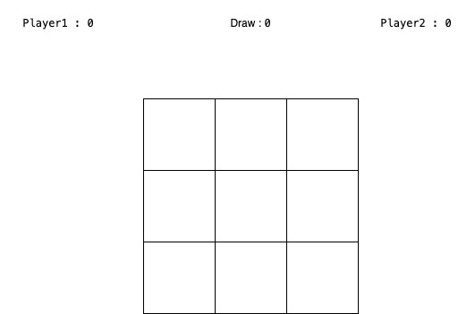

# project-1 Tic Tac Toe

A Tic tac toe game with a Simple design made with HTML CSS  JavaScript and JQuery track your Win and Draw score.


## Table of Contents

* User Stories
* Live Project
* winning Case
* Features
* Built with

## User Stories and wireframes 

*  As a user, I should be able to start a new tic tac toe game .
*  As a user, I should be able to click on a square to add X first and  then O, and so on .
*  As a user, I should not be able to click the same square twice .
*  As a user, I should be shown a message when I win, lose or tie .
*  As a user, I should not be able to continue playing once I win, lose, or tie .
*  As a user, I should be able to play the game again wen i click in another round button without refreshing the page and without losing player status .
*  As a user, I should be able to see the player status player win cunot, draw cunot .
*  As a user, I should be able to play the game again wen i click in Restart Game  button without refreshing the page to clear  player status . 





## Live Project

firebasea
https://test-65478.firebaseapp.com/

github
https://vex-xcc.github.io/project-1/


## winning Case  

    I solved  the winning Case by using two  function.

* first one
 
    take three argument and Comparative them if all these arguments equal to 'X' /n  then return 1  else if all argument equal to 'O'
            then return -1
            else return 0


``` 
    const checkWinner = function conditions(a, b, c) {

        if (a === 'X' && b === 'X' && c === 'X') {
            return 1;
        } else if (a === 'O' && b === 'O' && c === 'O') {
            return -1;
        } else {
            return 0;
        }
    }
```
* second function

        take board as argument and check the winning Cases
        if a player gets three in a row or column or diagonal.


```
    const winningCase = function checkWinCases(board) {

        return checkWinner(board[0], board[1], board[2]) +
            checkWinner(board[3], board[4], board[5]) +
            checkWinner(board[6], board[7], board[8]) +
            checkWinner(board[0], board[3], board[6]) +
            checkWinner(board[1], board[4], board[7]) +
            checkWinner(board[2], board[5], board[8]) +
            checkWinner(board[0], board[4], board[8]) +
            checkWinner(board[2], board[4], board[6]);
    }
```


## unsolved problem

 I need to add  multiplayer online features.


## Features


* Easy to play
* Track your score 
* Responsive Design


## Built with

* HTML
* CSS
* JavaScript
* JQuery


